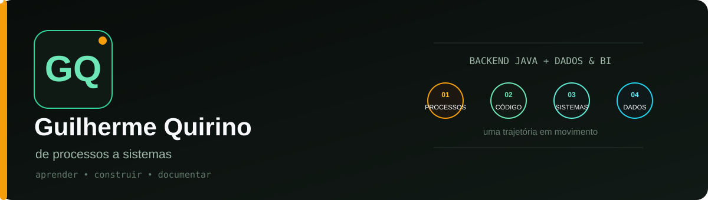
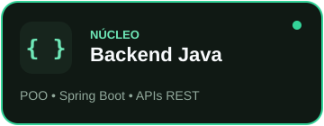
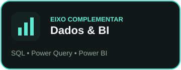
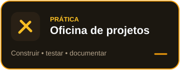

<div align="center">



<br>

<a href="#mapa-técnico"></a>
<a href="#mapa-técnico"></a>
<a href="#oficina-de-projetos"></a>

<sub>Os cartões são clicáveis — escolha um eixo para explorar.</sub>

<br><br>

[**Trajetória**](#trajetória) · [**Mapa técnico**](#mapa-técnico) · [**Projetos**](#oficina-de-projetos) · [**Painel vivo**](#painel-vivo) · [**Contato**](#contato)

</div>

---

## Trajetória

Eu não cheguei à tecnologia por uma linha reta.

Minha formação inicial é em **Gestão de Recursos Humanos** e minha experiência inclui rotinas administrativas, controles e planilhas. Foi observando tarefas repetitivas e informações dispersas que comecei a me interessar por automação, bancos de dados e desenvolvimento de sistemas.

Hoje curso **Análise e Desenvolvimento de Sistemas** e concentro meus estudos em **backend com Java**. A área de **dados e Business Intelligence** permanece como um eixo complementar: quero aprender não apenas a construir sistemas, mas também a organizar e interpretar os dados que eles produzem.

> **Meu objetivo:** transformar processos que conheço em soluções que eu seja capaz de modelar, programar, testar e explicar.

---

## Meu eixo de construção

| Etapa | Pergunta que orienta meu estudo | Ferramentas |
|---|---|---|
| **01 · Entender** | Qual problema precisa ser resolvido? | Processos, requisitos e regras de negócio |
| **02 · Modelar** | Como representar o problema no sistema? | POO, UML e modelagem de dados |
| **03 · Construir** | Como transformar o modelo em uma aplicação? | Java, Spring Boot e APIs REST |
| **04 · Interpretar** | O que os dados da aplicação podem revelar? | SQL, Excel, Power Query e Power BI |

Essa sequência conecta minha experiência anterior à direção profissional que estou construindo agora.

---

## Mapa técnico

<div align="center">


</div>

### Núcleo atual

`Java` · `Programação Orientada a Objetos` · `Spring Boot` · `APIs REST` · `JPA` · `SQL` · `Git`

### Base acadêmica e ferramentas complementares

`C` · `JavaScript` · `Node.js` · `Angular` · `HTML/CSS` · `Oracle Database` · `H2`

### Dados e automação

`Excel` · `Power Query` · `Power BI` · `VBA` · `Modelagem de dados`

<details>
<summary><strong>▸ Abrir meu método de aprendizagem</strong></summary>
<br>

Não pretendo me apresentar como especialista em todas essas tecnologias. Minha prioridade é consolidar **Java e backend**. Desenvolvimento web, bancos de dados e BI entram como conhecimentos complementares para construir soluções mais completas.

Meu ciclo de prática:

1. estudar o conceito;
2. desenhar a solução;
3. implementar uma versão pequena;
4. testar;
5. registrar o aprendizado no GitHub.

</details>

---

## Oficina de projetos

Aqui o portfólio funciona como um **registro de construção**, não como uma vitrine de projetos supostamente prontos. Abra os painéis para ver o problema, a stack e o estágio de cada trabalho.

<details open>
<summary><strong>● EM DESENVOLVIMENTO — API de tarefas com Spring Boot</strong></summary>
<br>

Projeto acadêmico para compreender uma API REST em camadas:

```text
Model → Repository → Service → Controller
```

Práticas envolvidas:

- orientação a objetos;
- persistência com JPA e banco H2;
- endpoints HTTP;
- testes de requisições;
- versionamento com Git.

**[Explorar o código no repositório POO-II →](https://github.com/Guilherme9727/POO-II)**

</details>

<details>
<summary><strong>○ PRÓXIMO — Controle financeiro pessoal</strong></summary>
<br>

Uma API para registrar receitas, despesas, categorias e parcelas. O projeto será usado para praticar regras de negócio, validações, tratamento de exceções, testes e PostgreSQL.

**Questão central:** como transformar movimentações financeiras em um modelo de domínio claro?

</details>

<details>
<summary><strong>◇ FUTURO — Dados de processos administrativos</strong></summary>
<br>

Um projeto inspirado em minha experiência com controles administrativos: organizar uma base fictícia, tratar os dados e criar indicadores em Power BI.

**Questão central:** como transformar controles operacionais em informação útil para decisão?

</details>

---

## Diário de bordo

- [x] Criar um perfil profissional no GitHub
- [x] Publicar uma API acadêmica em Java
- [ ] Documentar completamente o projeto POO-II
- [ ] Usar branches e pull requests no fluxo de desenvolvimento
- [ ] Adicionar testes automatizados
- [ ] Publicar o primeiro projeto autoral
- [ ] Integrar uma aplicação backend a um dashboard

<details>
<summary><strong>▸ Ver o que estou estudando agora</strong></summary>
<br>

- arquitetura em camadas no Spring Boot;
- responsabilidades de Model, Repository, Service e Controller;
- JPA e bancos relacionais;
- Git e GitHub além do fluxo básico;
- fundamentos de Node.js e Angular nas disciplinas da faculdade.

</details>

---

## Painel vivo

<details open>
<summary><strong>▾ Abrir atividade atualizada automaticamente</strong></summary>
<br>

<div align="center">


</div>

<sub>Os dados vêm dos repositórios públicos e mudam conforme novos commits são publicados.</sub>

</details>

---

## Princípio de trabalho

```text
entender o problema
        ↓
modelar antes de codificar
        ↓
construir uma versão pequena
        ↓
testar e corrigir
        ↓
documentar o que aprendi
```

---

## Contato

<div align="center">

[](https://www.linkedin.com/in/guilhermecqgomes/)
[](mailto:gomes.guilherme38@hotmail.com)
[](https://github.com/Guilherme9727?tab=repositories)

</div>

---

<div align="center">
<sub>Perfil construído como o próprio aprendizado: uma versão de cada vez.</sub>
</div>
